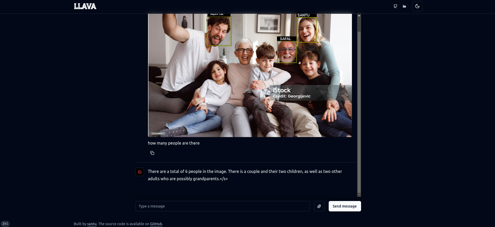

# llava Chat - Vision

This is the Frontend for a Multi Modal Chat Model, most likely works with GPT-4 also

Install dependencies

```
npm install
```

Modify the model backend url

`site.ts`

```
  modelBackend: "http://<host>:<port>/v1",
```

Run the frontend

```
npm run dev
```

NOTE: The frontend code is inspired from the `ai` sdk by vercel, although in this version i've added support for images with text, also multiple images!

The backend code can be found at [bakLlava-chat-vision](https://github.com/sh-aidev/bakLlava-chat-vision.git)

The model in the backend is `llava-hf/bakLlava-v1-hf`

# UI



# References
- [Source Code](https://github.com/satyajitghana/tsai-chat-vision)
